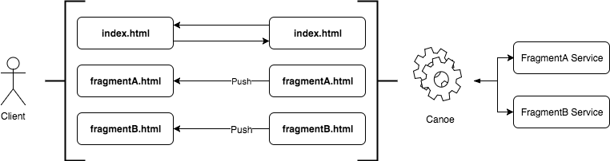

Canoe
=====

Canoe is a Web Application serving platform for front-end microservice architectures allowing development teams to create small "fragments" of ui that can then be rendered client-side via a pipelining system that uses HTTP2 Server Push



## Basic Server Setup

```go
package main

import (
	"log"
	"net/http"

	"github.com/chrismckenzie/canoe"
)

func main() {
	c := canoe.NewMemoryCache()
	r := canoe.NewHTTPFragmentResolver(http.DefaultClient, c)

	http.Handle("/static/", http.StripPrefix("/static/", http.FileServer(http.Dir("static"))))
	http.Handle("/fragments/", canoe.NewFragmentHandler(canoe.WithHTTPResolver(r)))
	http.Handle("/", canoe.NewHandler("/fragments/", http.Dir("examples"), c))

	err := http.ListenAndServeTLS(":18443", "server.crt", "server.key", nil)
	if err != nil {
		log.Fatal(err)
	}
}
```

## Creating An App Frame

An app frame is an html file that contains `canoe-fragment` elements in places when canoe will render a fragment.

```html
<html>
  <head>
    <title> testing canoe </title>
  </head>

  <body>
    <h2> hello World </h2>

    <canoe-fragment href="https://my-nav-header-service:8080/"></canoe-fragment>
  </body>
</html>
```

The `canoe-fragment` tag is an html custom element that will be in charge of loading and managing the state of the fragment.

## Creating A Fragment

A fragment is a piece of html wrapped in a html [`template`](https://developer.mozilla.org/en-US/docs/Web/HTML/Element/template) tag
that is served as a microservice for you frontend application by dividing applications
up into these fragments each portion of a web app can be developed independently from other
portions of the app. to create a fragment simply serve up and html file that looks like this.

```html
<template>
<style scoped>
  h2 {
    color: red;
  }
</style>
<h2> My super awesome fragment. </h2>
</template>
```

the `canoe-fragment` element will clone this bit of dom and place it into an
isolated shadow dom where it have its own javascript and css that are scoped to
the fragment.

## Security

Canoe strives to be a secure way to bring microservice architecture to the front-end
it achieve this by never exposing you backend fragment services to the client.

For Example when you write this.

```html
<canoe-fragment href="http://my-private-backend-fragment-server:8080/"></canoe-fragment>
```
canoe automatically converts this element into a client ready version which is
given an id that points to the fragment in th canoe cache canoe then carries out 
the retrieval of the fragment.
